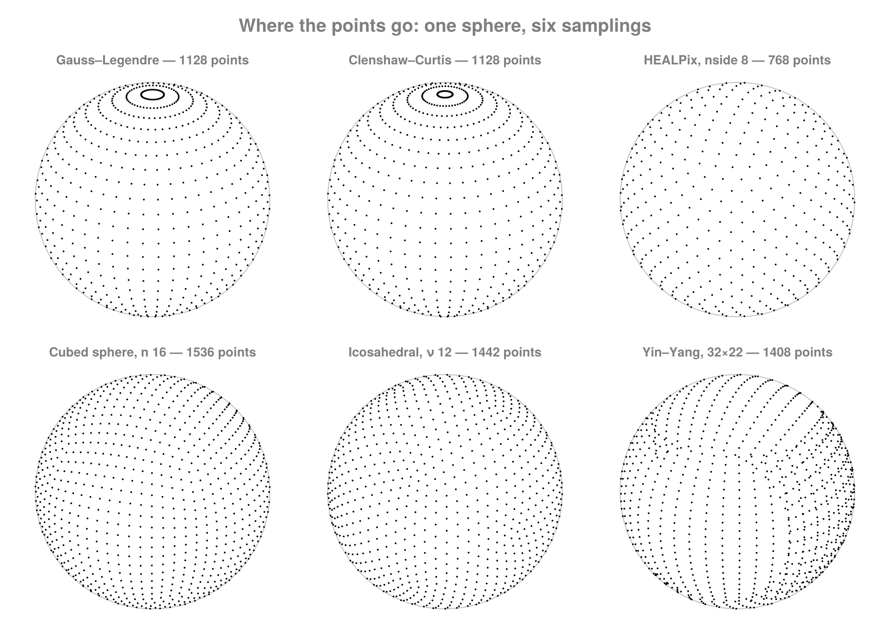
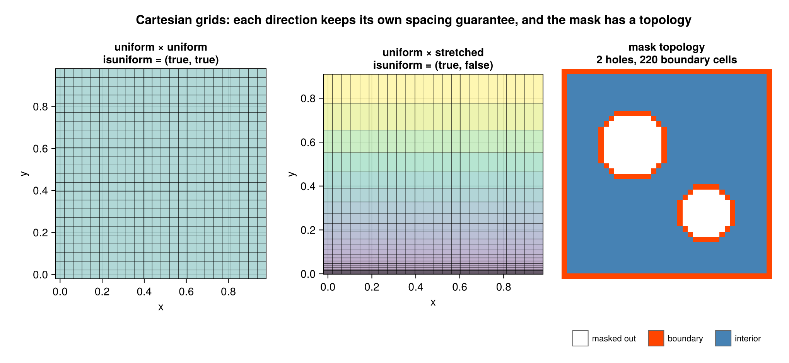
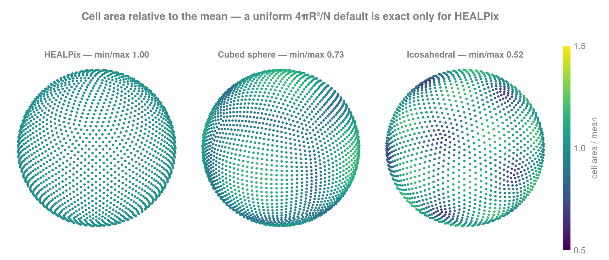
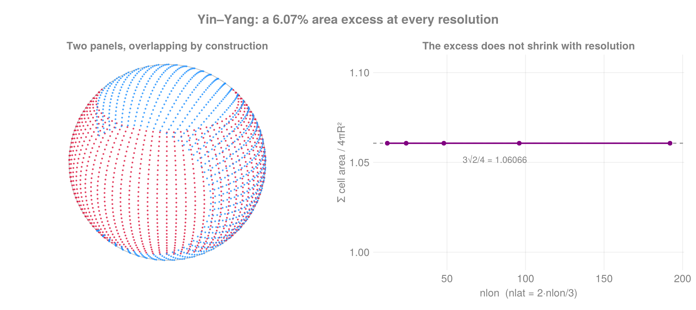
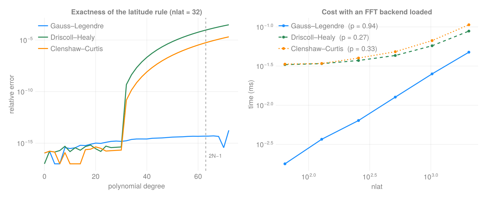

# FlowGeometries.jl

[](https://github.com/jbphyswx/FlowGeometries.jl/actions/workflows/ci.yml)
[](https://jbphyswx.github.io/FlowGeometries.jl/dev/)
[](https://codecov.io/gh/jbphyswx/FlowGeometries.jl)

Coordinate metrics, spherical samplings, and grid types — with a **dependency-free core**.



Fourteen samplings, three grid architectures, three metrics — chosen independently of each other, in
any number of dimensions. Spatial search, tessellation, sparse output, static vectors, FFT-based
quadrature, device transfer and threading all arrive through package extensions, so you pay for
exactly what you load.

**API style:** `using FlowGeometries: FlowGeometries as FG`, then qualified calls
(`FG.Grids.coords`, `FG.Geometry.distance`, …). Nothing is exported and nothing is rebound at the top
level — every name is reached through the submodule that defines it.

```julia
using FlowGeometries: FlowGeometries as FG

geo  = FG.Geometry.SphericalGeometry()
grid = FG.Connectivity.structured_grid(FG.SphericalSampling.GaussLegendreSampling(), 64)   # 127 × 64

FG.Grids.coords(grid, 3, 5)                                    # (λ = …, φ = …)
FG.Grids.measure(grid, 3, 5)                                   # that cell's area
sum(FG.Grids.measure(grid)) / (4π * geo.R^2)                   # ≈ 1
```

The same three choices on a plane, with a stretched vertical direction:

```julia
geo = FG.Geometry.CartesianGeometry()

# uniform in x and y, stretched in z — each direction keeps its own answer
z    = cumsum([0.0; fill(10.0, 4); fill(40.0, 4)])
grid = FG.Grids.StructuredGrid(geo, range(0, 1e5; length = 201), range(0, 1e5; length = 201), z;
                               periodic = (true, true), period = (1e5, 1e5))

FG.Grids.isuniform(grid, 1), FG.Grids.isuniform(grid, 3)   # (true, false)
FG.Grids.spacing(grid, 1)                                   # 500.0, read from the type
FG.Grids.measure(grid, 3, 4, 2)                             # that cell's volume
FG.Discretization.locate(FG.Grids.coordinates(grid, 3), 75.0)  # which z cell holds 75 m
```



## Three orthogonal choices

Geometry (the metric), sampling (where the points are), and grid architecture (how data is stored and
connected) are separate. Dispatch on the abstracts; use the concrete defaults as instances.

## Uniformity is a property of the type

A direction is either provably uniform — its spacing readable without touching a coordinate — or
genuinely stretched, and each direction of a grid keeps its own answer. That is what lets the exact
fast paths be selected at compile time: an `O(1)` point location, a constant cell width, a closed-form
neighbourhood bound.

```julia
FG.Grids.isuniform(grid, d)      # compile-time; const-folds
FG.Grids.spacing(grid, d)        # the constant Δ, signed
```

No code path inspects coordinate values to decide this, and there is no tolerance anywhere. Where the
data question matters, the spacing accessors answer it exactly — an axis is equally spaced precisely
when `minimum_spacing == maximum_spacing`.

A uniform axis stores three numbers, and its per-cell measure stores one, so a 2000×2000 uniform grid
is a few hundred bytes rather than tens of kilobytes — and nothing is materialized onto a device that
did not need to be.

## Any number of dimensions

One varargs constructor covers every `N`, and the mask is optional:

```julia
g4 = FG.Grids.StructuredGrid(geo, x, y, z, w)          # 4-D, all cells active
FG.Grids.topology(g4)                                   # per-direction Periodic/Bounded, from the type
```

Topology lives in the type because the cell measure depends on it: a wrapped boundary cell has a width
a bounded one does not, so a grid that could not tell the two apart would be describing a torus and an
interval with the same words.

## Stencils

Any shape, any radius, any dimension — `Axial`, `VonNeumann`, `Moore` (alias `Vertex`), `Diagonal`,
`Anisotropic`, `Custom`. Shape and radius live in the type, so the offset set is built at compile time
and the loop over it unrolls.

```julia
S = FG.Stencils
FG.Connectivity.build_connectivity(grid; stencil = S.Moore(2))
FG.Connectivity.nneighbors(grid, i, j; stencil = S.Anisotropic((3, 1)))
```

A stencil is named by its type, never a symbol: a symbol could only be resolved at run time, so the
neighbour iterator built from it would allocate once per cell.

A neighbourhood by physical distance rather than by cells is a `MetricBall`, queried under the
geometry's own metric — great-circle, Vincenty, or the chord where a radial direction is present —
with periodic seams wrapped by minimum image:

```julia
FG.Connectivity.neighbors_within(grid, i, j; ball = S.MetricBall(500e3))   # within 500 km
FG.Connectivity.nneighbors_within(grid, i, j; ball = 500e3)                # a bare radius works too
FG.Connectivity.build_connectivity_within(grid; ball = 500e3)              # the whole graph, as CSR
```

## Discretization primitives

Point location, interpolation weights, staggering, metric factors, and finite-difference weights for
**any** derivative order to **any** accuracy on **arbitrarily spaced** nodes — one recursion
(Fornberg 1988) rather than a tableau per case.

```julia
D = FG.Discretization
D.locate(axis, v)                     # O(1) uniform, O(log n) stretched
D.faces(axis), D.nodes(axis, D.Face())
D.interpolation_weights(axis, v)
D.fd_weights([-1.0, 0.0, 1.0], 0.0, 2)   # [1, -2, 1]
FG.Geometry.scale_factors(geo, point)    # (R cosφ, R) on a sphere
D.apply_stencil!(out, field, grid, 1; order = 1, nodes = 5)   # along one direction
```

`apply_stencil!` is the one function that touches a field, and only along a single direction with the
result left where the input was — a case whose conventions are all already fixed: nothing to stagger,
the stencil shifts inward at a bounded end and wraps on a periodic one, so no halo either. Anything
that genuinely needs a result location and a boundary-condition policy — a staggered difference, a
divergence, a curl — is a short call at the call site from these weights and metric terms, and is not
imposed here.

## Mask topology

```julia
FG.Connectivity.interior(grid), FG.Connectivity.boundary_cells(grid)
FG.Connectivity.connected_components(grid)
FG.Connectivity.count_holes(grid)     # enclosed inactive regions; wrapping changes the answer
```

## Cell areas are exact, in closed form



Every built-in sampling gets true cell areas with **no optional dependency** — spherical excess for
the cubed sphere, dual-cell areas from the mesh's own triangulation for icosahedral, lat–lon patches
for Yin–Yang. A uniform `4πR²/N` is exact only for HEALPix (flat colour above); on an icosahedral
geodesic the largest cell is nearly twice the smallest, so that default would silently corrupt every
area-weighted integral. The dark spots are the twelve pentagons.

```julia
g = FG.Connectivity.unstructured_grid(FG.SphericalSampling.IcosahedralSampling(16))     # 2562 nodes, Σarea = 4πR² exactly
```

Yin–Yang is the exception worth knowing about: its two panels **overlap by construction**, so the
cell areas sum to 6.07% more than the sphere — at *every* resolution. That is real geometry, not a
discretisation error.



## Quadrature



Nodes and weights come from a single solve — ask for both if you need both:

```julia
q = FG.SphericalSampling.spherical_quadrature(FG.SphericalSampling.GaussLegendreSampling(), 1024)   # (; λ, φ, w), Σw = 2
```

Gauss–Legendre holds machine precision out past degree `2N−1`; Driscoll–Healy and Clenshaw–Curtis
lose exactness just after `N−1`. That distinction is what `admits_exact_bandlimited_quadrature`
encodes — spectral analysis forms *products*, so it needs `2·lmax`, not `lmax`.

Gauss–Legendre is `O(n)` by asymptotic expansion (Bogaert 2014; Hale & Townsend 2013), with Newton on
the Bonnet recurrence for small `n` and for element types wider than `Float64`. Equiangular weights
are `O(n log n)` with any FFT backend loaded, and fall back to an exact recurrence without one.

## Connectivity


Topology of a *grid* or of a *sampling that defines a mesh*. A neighbour computation reads only
extent, wrapping and activity — never a coordinate — which is what `IndexTopology` captures, and why
a curvilinear grid needs no separate implementation from a structured one.

| Layout | How connectivity is obtained |
|--------|------------------------------|
| `StructuredGrid` / `CurvilinearGrid` | Index stencil (`Axial`/`VonNeumann`/`Moore`/`Diagonal`/`Anisotropic`/`Custom`, any radius, any `N`) + per-axis topology |
| `UnstructuredGrid` | CSR stored on the grid |
| Tensor-product samplings (GL, CC, DH, MW, lat–lon) | `build_connectivity(sampling, nlat)` — no grid is built |
| Cubed sphere | `build_connectivity(CubedSphereSampling(), n)` — 6 panels + gnomonic seams |
| Yin–Yang | `build_connectivity(YinYangSampling(), nlon, nlat)` — panel-local |
| HEALPix | `build_connectivity(HEALPixSampling(nside))` — RING topological neighbors |
| Icosahedral | `build_connectivity(IcosahedralSampling(ν))` — geodesic triangulation edges |

`unstructured_grid(sampling, …)` builds points + that CSR in one step. Prefer bang forms on hot paths
(`neighbors!`, `adjacency_matrix!`, `sparse_adjacency_csc!`, `healpix_neighbors!`) — they write into
your buffers and allocate nothing beyond their return value.

## Points and frames

The point type from `coords` is a geometry-named `NamedTuple`: `(x=, y=)` or `(λ=, φ=)`. Asking for
the wrong name is an error, never a silent alias for the other quantity. Escapes:
`coords!(out, …)`, `coords(NTuple{2,T}, …)`, `coords(SVector{2,T}, …)` with StaticArrays.

Spherical vector / tangent helpers use the polar frame (`λ`, `φ`, `r`), not east/north:
`local_tangent_basis` → `(; λ=ê_λ, φ=ê_φ)`, `spherical_to_cartesian` / `cartesian_to_spherical`
↔ `(; x,y,z)` / `(; λ,φ,r)`.

## Storage

A structured grid's cell measure is stored as its per-axis factors, not the `∏ Nᵈ` products — it is a
real `AbstractArray`, so indexing and broadcasting are unchanged, but 2000² costs 0.046 MiB instead
of 61 MiB and `sum` is `O(∑ Nᵈ)`. An all-active mask (`AllActive`) stores only its size.

```julia
FG.Grids.measure_factors(grid)     # the factors, or `nothing`
FG.Grids.measure_array(grid)       # materialize densely, if you truly need it
```

## Defaults

| Abstract | Default |
|----------|---------|
| `AbstractCartesianGeometry` | `CartesianGeometry` |
| `AbstractSphericalGeometry` | `SphericalGeometry` |
| `AbstractEllipsoidalGeometry` | `SpheroidGeometry` (WGS 84) |
| `AbstractReducedGaussianSampling` | `OctahedralGaussianSampling` |
| `AbstractGaussLegendreSampling` | `GaussLegendreSampling` |
| `AbstractDriscollHealySampling` | `DriscollHealySampling` / `DriscollHealyEqualSampling` |
| `AbstractClenshawCurtisSampling` | `ClenshawCurtisSampling` |
| `AbstractMcEwenWiauxSampling` | `McEwenWiauxSampling` |
| `AbstractLatLonSampling` | `LatLonSampling` |
| `AbstractHEALPixSampling` | `HEALPixSampling` |
| `AbstractCubedSphereSampling` | `CubedSphereSampling` |
| `AbstractIcosahedralSampling` | `IcosahedralSampling` |
| `AbstractYinYangSampling` | `YinYangSampling` |
| `AbstractScatteredSphericalSampling` | `ScatteredSphericalSampling` |
| `AbstractStencil` | `Axial` / `VonNeumann` / `Moore` / `Diagonal` / `Anisotropic` / `Custom` |
| `AbstractTopology` | `Periodic` / `Bounded` |
| `AbstractLocation` | `Center` / `Face` |
| `AbstractStructuredGrid` | `StructuredGrid` |
| `AbstractCurvilinearGrid` | `CurvilinearGrid` |
| `AbstractUnstructuredGrid` | `UnstructuredGrid` |

## Extensions

| Load | Unlocks |
|------|---------|
| `NearestNeighbors` | k-d-tree neighbours for `UnstructuredGrid` |
| `Quickhull` | spherical Voronoi areas for arbitrary point sets |
| `DelaunayTriangulation` | planar Voronoi areas |
| `SparseArrays` | `sparse_adjacency_matrix` → CSC |
| `StaticArrays` | `SVector` / `MVector` points end to end |
| `AbstractFFTs` | `O(n log n)` equiangular quadrature weights |
| `Adapt` | move a grid to another storage backend |
| `ComputationalBackends` | opt-in threading, bit-identical to serial |

```julia
using ComputationalBackends: ThreadedBackend
FG.Connectivity.build_connectivity(grid; backend = ThreadedBackend())   # 3.7–4.3× on 8 threads
```

## Documentation

Full docs: <https://jbphyswx.github.io/FlowGeometries.jl/dev/>

```julia
julia --project=docs -e 'using Pkg; Pkg.instantiate(); include("docs/make.jl")'   # build locally
julia --project=docs/generate_assets docs/generate_assets/generate_assets.jl      # regenerate figures
```
