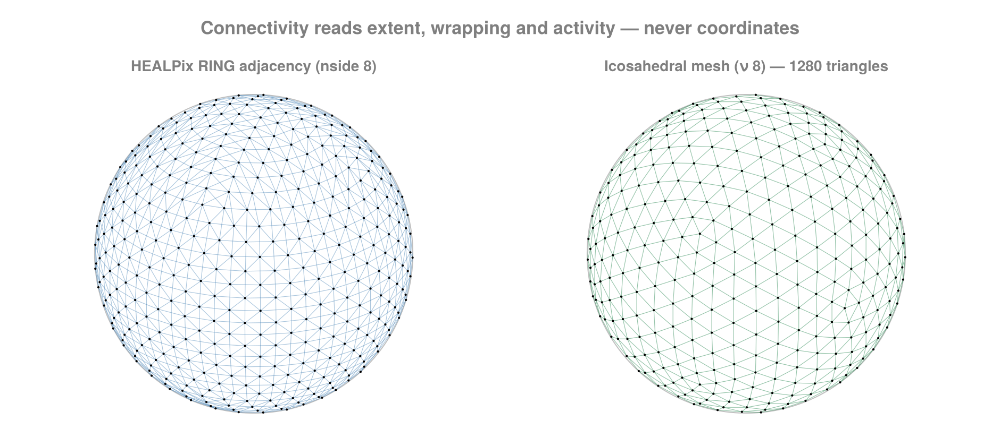

```@meta
CurrentModule = FlowGeometries.Connectivity
```

```@setup connectivity
using FlowGeometries: FlowGeometries as FG
geo   = FG.Geometry.SphericalGeometry()
grid  = FG.Connectivity.structured_grid(FG.SphericalSampling.ClenshawCurtisSampling(), 16)
conn  = FG.Connectivity.build_connectivity(grid)
i, j  = 3, 5
nlon, nlat = size(grid)
n     = 4
nside = 4
out   = Vector{Int}(undef, 64)
A     = falses(length(grid), length(grid))
topo  = FG.Connectivity.IndexTopology((nlon, nlat), (true, false), nothing)
lin   = 7
```

# [Stencils & Connectivity](@id connectivity-page)

Connectivity answers: **which cells are neighbours?**

## Stencil shapes

A stencil is a neighbourhood *shape* in index space. It carries no dimensionality — the same shape
applies to a 2-D and a 5-D grid — and its shape and radius live in its type, so the offset set is
built at compile time and a loop over it unrolls.

```@example conn
using FlowGeometries: FlowGeometries as FG
S = FG.Stencils

S.offsets(S.Axial(1), Val(2))
```

```@example conn
S.offsets(S.Moore(1), Val(2))
```

| shape | offsets | meaning |
|---|---|---|
| `Axial(r)` | `2·N·r` | axis-aligned only, `±k·êᵈ` for `k = 1…r` |
| `VonNeumann(r)` | — | the `L¹` ball, `0 < ‖δ‖₁ ≤ r` |
| `Moore(r)` (alias `Vertex`) | `(2r+1)^N − 1` | the `L^∞` ball, the surrounding box |
| `Diagonal(r)` | `2^N·r` | pure diagonals only |
| `Anisotropic(radii)` | — | a box with its own radius per direction |
| `Custom(offsets)` | as given | an explicit offset set |

`Axial(1)` and `VonNeumann(1)` are the same four-in-2-D set; beyond radius 1 they differ, because
`VonNeumann` admits diagonal combinations whose step count still fits.

```@example conn
S.nstencil(S.Axial(2), Val(2)), S.nstencil(S.VonNeumann(2), Val(2)), S.nstencil(S.Moore(2), Val(2))
```

Any dimension:

```@example conn
S.nstencil(S.Axial(1), Val(5)), S.nstencil(S.Moore(1), Val(5))
```

```@example conn
S.reach(S.Anisotropic((3, 1)), Val(2))     # halo width per direction
```

!!! note "A stencil is named by its type, never by a symbol"
    A symbol could only be resolved at run time, so the neighbour iterator built from it would not be
    concretely typed and every cell of a traversal would allocate. `stencil = S.Moore(2)` is free;
    there is no symbol form to reach for.

### Your own shape

A shape supplies [`Stencils.offsets`](@ref) and nothing else. Put whatever the offsets depend on in the
type, so the tuple is inferable — then `nstencil`, `reach`, `foreach_offset`, `fold_offsets` and every
neighbour query work on it, with the loop still unrolled and nothing allocated.

```@example conn
struct Upwind{R} <: S.AbstractStencil end
Upwind(r::Integer) = Upwind{Int(r)}()
S.offsets(::Upwind{R}, ::Val{N}) where {R,N} =
    ntuple(i -> ntuple(d -> d == cld(i, R) ? mod1(i, R) : 0, Val(N)), Val(N * R))

S.offsets(Upwind(2), Val(2)), S.nstencil(Upwind(2), Val(3)), S.reach(Upwind(2), Val(2))
```

```@example conn
gu = FG.Grids.StructuredGrid(FG.Geometry.CartesianGeometry(),
                             range(0.0; step = 1.0, length = 6),
                             range(0.0; step = 1.0, length = 5))
FG.Connectivity.nneighbors(gu, 2, 2; stencil = Upwind(1)),
FG.Connectivity.nneighbors(gu, 6, 5; stencil = Upwind(1))
```

Two different things get called a radius, and they are separate types.
[`Stencils.CellRadius`](@ref) counts cells in index space; [`Stencils.MetricBall`](@ref) is a physical
distance measured through the geometry. On a stretched or spherical grid the number of cells within a
given distance varies across the grid, so the two cannot be collapsed into one.

## Neighbourhoods by distance

A [`Stencils.MetricBall`](@ref) is queried with [`Connectivity.neighbors_within`](@ref) and its
buffer/counting forms — every cell whose centre lies within the given physical distance, under the
geometry's own metric:

```@example conn
geo = FG.Geometry.SphericalGeometry()            # Earth radius, metres
λ = range(0, 2π; length = 25)[1:24]
φ = range(-π/2, π/2; length = 13)
g = FG.Grids.StructuredGrid(geo, λ, φ)
ball = S.MetricBall(2.0e6)                       # everything within 2000 km
FG.Connectivity.nneighbors_within(g, 5, 7; ball = ball)
```

The same call near a pole finds many more cells, because 2000 km spans every longitude there — which is
exactly why this cannot be a stencil:

```@example conn
FG.Connectivity.nneighbors_within(g, 5, 13; ball = ball)
```

A bare number works as the ball, and the buffer form follows the `neighbors!` pattern — size with the
count, fill in place:

```@example conn
n = FG.Connectivity.nneighbors_within(g, 5, 7; ball = 2.0e6)
buf = Vector{Int}(undef, n)
FG.Connectivity.neighbors_within!(buf, g, 5, 7; ball = 2.0e6)
buf
```

The candidate window is [`Connectivity.metric_window`](@ref) — `O(1)` per direction on any separable
axis, uniform or stretched, given the minimum steps [`Connectivity.MetricTopology`](@ref) carries —
and each candidate is then kept or dropped by the geometry's `distance`, so the result is a genuine
metric ball: great-circle on a sphere, Vincenty on a spheroid, the chord where a radial or height
direction is present. Periodic directions wrap by minimum image, so a ball sitting on the seam is the
same ball as anywhere else:

```@example conn
FG.Connectivity.neighbors_within(g, 1, 7; ball = 1.5e6) ==
    FG.Connectivity.neighbors_within(g, 1, 7; ball = S.MetricBall(1.5e6))
```

### Distance between two cells

`Geometry.distance` also takes two cell indices, resolving them through the grid's own topology. Across a
periodic seam that is the short way round, not the full extent:

```@example conn
gper = FG.Grids.StructuredGrid(FG.Geometry.CartesianGeometry(),
                               range(0.0; step = 1.0, length = 10),
                               range(0.0; step = 1.0, length = 6);
                               periodic = true, period = 10.0)
FG.Geometry.distance(gper, (1, 1), (10, 1)), FG.Grids.displacement(gper, (1, 1), (10, 1))
```

[`Grids.displacement`](@ref) is the signed per-direction offset that distance was taken from — a
coordinate quantity, which is why it sits in `Grids` while the distance extends `Geometry.distance`.

### Convolutions need every image, not the nearest one

A neighbour set visits each cell once, at its nearest image. A convolution on a torus cannot: with period
`L`,

```math
\\bar f(x) = \\int K(x-y) f(y)\\,dy = \\sum_k \\int_\\text{cell} K(x-y-kL) f(y)\\,dy
```

so once the kernel support exceeds `L/2` one cell contributes through several images at different
displacements. [`Connectivity.fold_within`](@ref) takes the convention as an argument —
[`NearestImage`](@ref) or [`AllImages`](@ref) — and `AllImages` also widens the window, since
`metric_window`'s one-turn cap would itself discard those images.

```@example conn
Nx, Δx = 32, 62.5; Lx = Nx * Δx
axx = range(0.0; step = Δx, length = Nx)
gt = FG.Grids.StructuredGrid(FG.Geometry.CartesianGeometry(), axx, axx;
                             periodic = (true, true), period = (Lx, Lx))
count_within(conv, rad) = FG.Connectivity.fold_within(
    (a, J, d) -> a + 1, 0, gt, 1, 1; ball = rad, images = conv)
count_within(FG.Connectivity.NearestImage(), 3500.0),
count_within(FG.Connectivity.AllImages(), 3500.0)
```

Below `L/2` the two agree exactly, so nothing that was already correct changes. Above it, filtering one
Fourier mode with a Gaussian of width `ℓ = L` reproduces the analytic transfer `exp(-k²ℓ²/4α)` to
roundoff under `AllImages`, while the nearest-image error stays at 40% no matter how far the support is
widened — the images it drops cannot be recovered by searching further.

Summing images asserts that a periodic direction is a *translation* of the domain. On a sphere it is an
identification instead — `λ` and `λ+2π` are the same point — so `AllImages` is refused there rather than
counting one cell repeatedly.

`self = true` folds the centre cell too, at distance zero. A neighbour set excludes it; a convolution
needs it, and it carries the kernel's largest weight.

To query every cell, materialize the whole graph once instead —
[`Connectivity.build_connectivity_within`](@ref) is the ball analogue of `build_connectivity`, row `k`
holding exactly what the per-cell query returns for cell `k`, and symmetric because the metric is:

```@example conn
csr = FG.Connectivity.build_connectivity_within(g; ball = 2.0e6)
FG.Connectivity.nedges(csr), FG.Connectivity.is_symmetric_adjacency(csr)
```

### What a ball query reads about the grid

The observation the stencil side of the module rests on is that a neighbour computation never looks at a
coordinate. It reads three things — extent per dimension, wrapping per dimension, and which cells are
active — and nothing else. That triple is `IndexTopology`, and it is why a curvilinear grid needs no
separate implementation from a structured one: it is the `N = 2` case of the same algorithm.

A ball query is the one thing that cannot work that way. It needs coordinates, and the smallest step per
direction, which is what bounds the candidate window on a **stretched** axis. That is
[`Connectivity.MetricTopology`](@ref), the same idea for the metric path — and it is `O(1)` to build,
because it reads the per-axis reductions through [`Grids.minimum_spacing`](@ref) and
[`Grids.bounds`](@ref), which every layout answers without a scan:

```@example conn
mt = FG.Connectivity.MetricTopology(g)
FG.Connectivity.nneighbors_within(g, 5, 7; ball = ball, topology = mt)
```

So passing it changes nothing and omitting it costs nothing — the default is already free. There is no
hoisting to remember here.

The spatial index is different: it *is* worth hoisting, and it is not built for a single query, because
building one costs more than the one scan it would replace. Curvilinear and node grids have no separable
axes for a window to bound, so without an index a query tests every cell.

[`Grids.cell_list`](@ref) is the one to reach for, and it needs no package at all. It bins the cell
centres at the radius you mean to query at, and a query visits the bins its ball can reach:

```@example conn
gc = FG.Connectivity.unstructured_grid(FG.SphericalSampling.HEALPixSampling(8))
top = FG.Connectivity.MetricTopology(gc; index = FG.Grids.cell_list(gc; ball = 2.0e6))
FG.Connectivity.nneighbors_within(gc, 1; ball = 2.0e6, topology = top)
```

Every cell lands in exactly one bin — periodicity wraps the bin coordinate rather than replicating the
point — so a query emits each cell once and needs no buffer to deduplicate into. That is what lets it
run inside a kernel, and it is why the sweeps build one by default.

[`Connectivity.indexed`](@ref) is the alternative, a k-d tree, and needs `NearestNeighbors`:

```@example conn
using NearestNeighbors                                    # loads the extension
gu = FG.Connectivity.unstructured_grid(FG.SphericalSampling.HEALPixSampling(8))
ixu = FG.Connectivity.indexed(gu)
scratch = FG.Connectivity.ball_scratch()
FG.Connectivity.nneighbors_within(gu, 1; ball = 2.0e6, topology = ixu, scratch = scratch)
```

The index only ever returns a *superset* of the ball — the exact `distance ≤ r` gate still decides
membership — so an indexed query and a scan return the same cells, and loading the extension changes
speed and nothing else.

A neighbour list is a **set**: which order the cells come back in is whatever enumerated them, and no
query sorts, since that would put an `O(m log m)` pass on top of an `O(m)` query for something nothing
needs. [`Connectivity.sort_neighbors!`](@ref) is there when you do want it.
[`Connectivity.ball_scratch`](@ref) is the candidate buffer, one per task; without it each query
allocates its own.

### Sweeping every cell

Better still, do not write the loop. [`Connectivity.foreach_within`](@ref) and
[`Connectivity.mapreduce_within`](@ref) walk every cell's ball and build the topology *and* the index
once for the whole sweep, which is what makes them `O(n log n)` where the hand-written loop is `O(n²)` —
9× on a 9 216-cell curvilinear grid here:

```@example conn
FG.Connectivity.mapreduce_within((I, J, d) -> 1, +, 0, g; ball = 1.0e6)   # total pairs within 1000 km
```

```@example conn
FG.Connectivity.mapreduce_within((I, J, d) -> d, +, 0.0, g; ball = 1.0e6) # and the total distance
```

`foreach_within` is the same traversal for an `f` that writes rather than reduces; under a threaded
`backend` it runs on disjoint spans of cells, so what `f` writes must be determined by `I`.
`build_connectivity_within` does the same hoisting internally.

### The k nearest

A ball asks "everything within `r`". The other question is "the nearest `k`", and
[`Connectivity.k_nearest`](@ref) answers it exactly under the same metric, on every architecture:

```@example conn
idx, dist = FG.Connectivity.k_nearest(g, 5, 7; k = 4)
dist
```

It widens a ball until `k` cells have been seen and keeps the `k` smallest in a bounded heap, so the
result never depends on the starting radius and nothing is materialized along the way. Equal distances
resolve by linear index, which is what makes an indexed query and a scan agree exactly.
[`Connectivity.k_nearest!`](@ref) writes into your own buffers and allocates nothing.

### Seeding from a coordinate rather than a cell

Every query above starts at a cell. Observational data does not arrive that way — a station, a ship
track or a float has a coordinate, and the cell it belongs to is part of the question. Passing a
coordinate where the cell indices would go asks the same questions about a point — written as a
`Tuple`, `NamedTuple`, `AbstractVector` or `SVector`, as anywhere else a point is taken:

```@example conn
FG.Grids.locate(g, (0.4, 0.1))                    # the cell the point falls in
```

```@example conn
length(FG.Connectivity.neighbors_within(g, (0.4, 0.1); ball = 1.0e6)),
FG.Connectivity.k_nearest(g, (0.4, 0.1); k = 3)[2]
```

[`Connectivity.fold_at`](@ref) is the fold behind them, as [`Connectivity.fold_within`](@ref) is for a
cell. There is no seed cell to skip, so unlike the cell-seeded form every cell within the ball is
visited — including the point's own.

`locate` is the containing cell on a rectilinear grid, per direction and wrapping a periodic one, and
the nearest cell centre elsewhere. For a node set those are the same thing, its cells being the Voronoi
regions of its nodes; on a strongly sheared curvilinear grid they can differ, so it is documented as
nearest-centre rather than point-in-quadrilateral.

The traversal is the cell-seeded one with the window widened by how far the point sits from its cell's
centre, so it stays `O(1)` per direction rather than degenerating into a scan. Off the rectilinear
grids the cost depends on the index: [`Grids.cell_list`](@ref) answers "which bins does this
point's ball reach" directly, and is the reason a point query need not visit every cell.

### The ball, and the part of it you can get to

A ball is not a connected patch. With a mask, or a concave domain, it can contain cells that are close to
the seed in space but reachable from it only by leaving the ball. Both sets are useful and they are
different algorithms, so `reach` names which one you get:

```@example conn
wall = trues(9, 9); wall[:, 5] .= false                  # a barrier through the middle
gw = FG.Grids.StructuredGrid(FG.Geometry.CartesianGeometry(),
                             collect(0.0:8.0), collect(0.0:8.0), wall)
length(FG.Connectivity.neighbors_within(gw, 5, 3; ball = 3.5)),
length(FG.Connectivity.neighbors_within(gw, 5, 3; ball = 3.5,
                                        reach = FG.Connectivity.Connected(S.Moore(1))))
```

[`Connectivity.Unrestricted`](@ref) is every cell within the radius, and the default.
[`Connectivity.Connected`](@ref) is the connected component of that set containing the seed: it walks
adjacency and prunes at the ball's edge, so it is a subset. The two agree whenever the ball is connected
under the adjacency — always so on a maskless Cartesian `StructuredGrid`, where each index step moves
monotonically in one coordinate — and `Connected` is strictly smaller wherever something separates two
parts of the ball.

The two are easy to conflate, so it is worth being precise about why one cannot be computed as a cheaper
version of the other. Take cells `P` (the seed), `Q` and `R`, adjacent only as `P–Q–R`, with
`d(P,Q) = 1.2r` and `d(P,R) = 0.8r`. Walking outward from `P` and dropping anything farther than `r`
stops at `Q`, so it never reaches `R` — which *is* inside the ball. That walk is not a broken
`Unrestricted`; it is exactly `Connected`.

Adjacency has to be named, because only a node set carries its own: `Connected()` means direction-1
adjacency on the index-space architectures and the stored neighbour lists on an `UnstructuredGrid`, and
`Connected(stencil)` sets it explicitly for the former. On the latter a stencil has no index space to
mean anything in, so it is refused rather than ignored.

## Querying neighbours




Three forms, in increasing order of how much they allocate:

```@example connectivity
out = Vector{Int}(undef, 8)
n = FG.Connectivity.neighbors!(out, grid, i, j; stencil = FG.Stencils.Moore(1))   # writes n indices
k = FG.Connectivity.nneighbors(grid, i, j)                            # just the count
it = FG.Grids.neighbors(grid, i, j)                            # lazy iterator, no array
```

`stencil` is any [`Stencils`](@ref) shape — `Axial(r)`, `VonNeumann(r)`, `Moore(r)` (alias `Vertex`),
`Diagonal(r)`, `Anisotropic(radii)` or `Custom(offsets)` — at any radius and in any number of
dimensions. It is named by its TYPE, not by a symbol: a symbol could only be resolved at run time, and
the neighbour iterator built from it would then allocate once per cell. `active_only = true`
excludes masked-out cells from both ends of an edge.

Prefer `neighbors!` in hot loops. `neighbors` returns an iterator rather than a freshly built vector
per cell, which would cost two heap allocations for every cell visited.

## CSR

For a whole graph at once:

```@example connectivity
conn = FG.Connectivity.build_connectivity(grid)                   # or (sampling, args...)
FG.Connectivity.nnodes(conn), FG.Connectivity.nedges(conn)
FG.Grids.neighbors(conn, i)                                # a view into the flat array
```

`CSRConnectivity` stores one flat neighbour array plus offsets — never a vector per node, which costs
`nnodes` allocations and turns every later traversal into pointer chasing. Both buffers are typed
independently and accept any `Integer`, so a large mesh can carry `Int32` indices.

Building from a sampling never constructs a grid:

```@example connectivity
FG.Connectivity.build_connectivity(FG.SphericalSampling.GaussLegendreSampling(), 1000)
```

The neighbour graph of a tensor-product sampling is fixed by its axis *lengths* and longitude
wrapping alone, so the axes are never evaluated — for Gauss–Legendre that alone would be an O(n²)
root solve, to produce numbers the answer does not depend on.

## Index topology directly

```@example connectivity
topo = FG.Connectivity.IndexTopology((nlon, nlat), (true, false), nothing)   # mask = nothing → all active
conn = FG.Connectivity.build_connectivity(topo; stencil = FG.Stencils.Axial(1))
```

Useful when you have a shape and a wrapping rule but no grid, and enough to drive every stencil query
in the package.

## Dense and sparse adjacency

```@example connectivity
FG.Connectivity.adjacency_matrix(conn)                       # Matrix{Bool}
FG.Connectivity.adjacency_matrix!(A, conn)                   # into your buffer
# needs SparseArrays; see the Extensions page
# FG.Connectivity.sparse_adjacency_matrix(grid)
```

!!! warning "The dense form is N × N"
    `adjacency_matrix` on a 1000² grid asks for a 10⁶ × 10⁶ `Matrix{Bool}` — 10¹² bytes. It exists for
    small grids and for testing. Use `sparse_adjacency_matrix` for anything real.

The sparse path builds CSC straight from the neighbour list by one counting pass and one placement
pass — no coordinate triples, no sort, no permutation vector, and row indices come out ascending for
free because the placement walks nodes in order.

For a **symmetric** adjacency with sorted rows the CSR and CSC arrays are the *same* arrays, so
`sparse_adjacency_matrix(grid)` on a structured or curvilinear grid hands the connectivity's own
buffers to the matrix rather than transposing into a second copy.

```@example connectivity
FG.Connectivity.is_symmetric_adjacency(conn)   # what licenses that shortcut
FG.Connectivity.sort_neighbors!(conn)          # order each node's block ascending, in place
```

## Threading

Every builder takes an opt-in `backend`; see [Performance](@ref performance-page).

```julia
using ComputationalBackends: ThreadedBackend
FG.Connectivity.build_connectivity(grid; backend = ThreadedBackend())
```

Results are bit-identical to serial, which the test suite asserts with `==` rather than a tolerance.

## Sampling-specific topology

```@example connectivity
FG.Connectivity.build_connectivity(FG.SphericalSampling.HEALPixSampling(64))              # RING face-table adjacency
FG.Connectivity.build_connectivity(FG.SphericalSampling.CubedSphereSampling(), n)         # with the gnomonic seam fold
FG.Connectivity.build_connectivity(FG.SphericalSampling.YinYangSampling(), nlon, nlat)
FG.Connectivity.healpix_neighbors!(out, nside, 0)             # one pixel; 0-based pixel ids
```

HEALPix RING neighbours follow the standard face-table algorithm (Górski et al. 2005; Reinecke 2003).
The offsets are walked in ring order, so the emitted ids arrive already ascending for ~99% of pixels
and the dedup pass has almost nothing to move.

## Mask topology

The mask's own shape is a grid property, so it is answered here.

```@example conn
C = FG.Connectivity
geo = FG.Geometry.CartesianGeometry()
m = trues(9, 9)
m[4:6, 4:6] .= false          # an enclosed block
g = FG.Grids.StructuredGrid(geo, 0.0:1.0:8.0, 0.0:1.0:8.0, m)

C.count_holes(g), C.connected_components(g)[2]
```

```@example conn
count(C.interior(g)), count(C.boundary_cells(g)), count(m)
```

`interior` is the active cells whose whole stencil is active and in range; `boundary_cells` is the
rest of the active set, and the two partition it. `count_holes` counts the connected inactive regions
fully enclosed by active cells — an estimate of the active region's first Betti number. A region that
reaches a non-wrapping edge is outside rather than enclosed, so wrapping a direction can turn one into
the other:

```@example conn
gp = FG.Grids.StructuredGrid(geo, 0.0:1.0:8.0, 0.0:1.0:8.0, m;
                             periodic = (true, true), period = (9.0, 9.0))
C.count_holes(gp)
```

All of it is dimension-generic:

```@example conn
m3 = trues(7, 7, 7); m3[3:5, 3:5, 3:5] .= false
C.count_holes(FG.Grids.StructuredGrid(geo, 0.0:1.0:6.0, 0.0:1.0:6.0, 0.0:1.0:6.0, m3))
```

## Index helpers

```@example connectivity
FG.Connectivity.linear_index(grid, i, j)      # column-major, i fastest
FG.Connectivity.cartesian_index(grid, lin)    # the inverse
```
